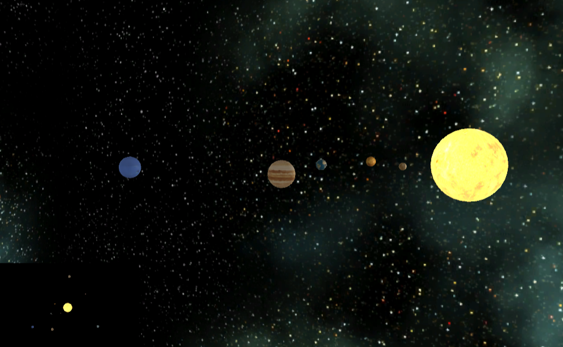

# Unity3D_SolarSystem_WebGL
WebGL build of a Unity3D hands-on miniproject.

The goal was to learn how to create a basic scene within Unity3D.

Working WebGL live app can be found [here](https://romxz-unity3d-tut-solar-system-toy.glitch.me). Based on the week 2 miniproject of [this](https://www.coursera.org/learn/game-development) course on GameDev with Unity.
